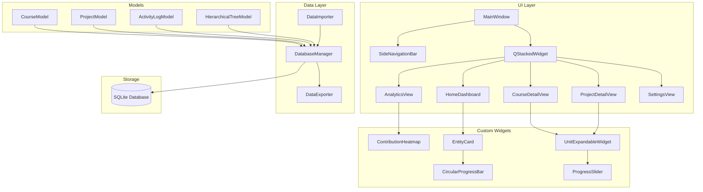
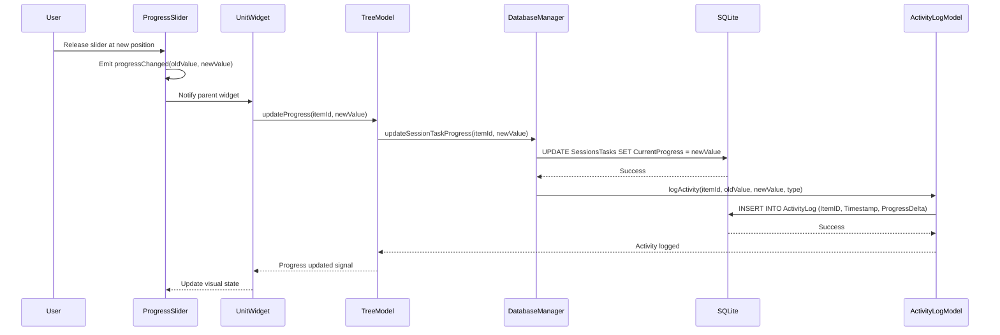
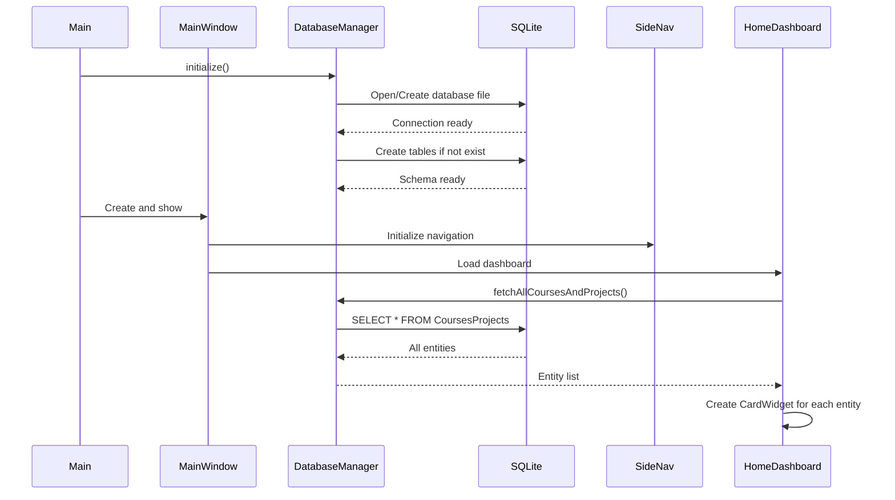
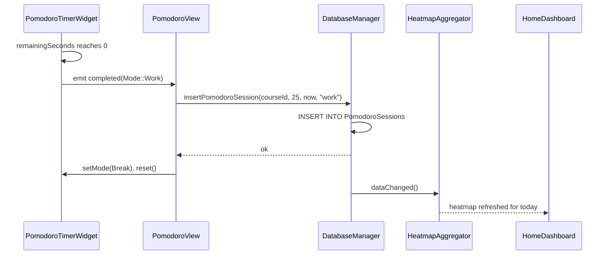

# Design Document: CTracker

> **Versioning note**: This document describes the *full* v2 design. The implementation plan (`tasks.md`) is now a single linear sequence (no v1 → v2 split); the "Expansion" sub-sections in this document are retained for historical context but are no longer treated as a separate phase.
>
> **Source-tree convention (added with the merged plan)**: implementation files live under feature-grouped folders. `include/` and `src/` each contain `core/`, `shared/`, `courses/`, `projects/`, `todos/`, `pomodoro/`, `analytics/`, `calendar/`, `settings/`. Rule: *one folder per top-level feature; `core/` for the data layer; `shared/` for cross-feature widgets and chrome*. Cross-folder references use the form `#include "feature/Foo.h"` from the single include root.
>
> **Component-to-folder map**:
> - `core/` — DatabaseManager, DataStructures, DataImporter, DataExporter
> - `shared/` — MainWindow, SideNavigationBar, HomeDashboard, CircularProgressBar, StatsCard, CategoryPill, CategoryModel, EntityCreateDialog
> - `courses/` — CoursesView, CourseDetailView, EntityCard, UnitExpandableWidget, SessionTaskRow, CoursesFilterBar
> - `projects/` — ProjectsView, ProjectDetailView, ProjectCard
> - `todos/` — TodoView, TodoRow, TodoModel
> - `pomodoro/` — PomodoroView, PomodoroTimerWidget
> - `analytics/` — AnalyticsView, ContributionHeatmap, ActivityLogModel, HeatmapAggregator
> - `calendar/` — CalendarWidget, DayDetailsPanel
> - `settings/` — SettingsView
>
> **Implementation Constraint (non-negotiable)**: The `design/` folder (React + TypeScript + Tailwind + Radix + Recharts) is a **visual and interaction reference only**. Every widget, view, chart, and behavior described in this document is implemented in **Qt 6 + C++17 + QSS**:
> - React components → custom `QWidget` / `QFrame` subclasses
> - JSX layouts → `QHBoxLayout` / `QVBoxLayout` / `QGridLayout`
> - Tailwind utility classes → handwritten QSS rules in `assets/styles/dark-industrial.qss`
> - Radix UI primitives → native Qt equivalents (`QMenu`, `QToolTip`, `QDialog`, `QComboBox`, etc.)
> - Recharts → `Qt6::Charts` (`QLineSeries`, `QBarSeries`, `QPieSeries`, `QChartView`)
> - Lucide React icons → SVG assets rendered via `Qt6::Svg`
> - React state hooks → member variables wired with `connect()` signal/slot calls
>
> No React, TypeScript, Tailwind, shadcn/ui, Radix, or Recharts code is ported, embedded, executed, or shipped. The React prototype is never built into the Qt binary; it only informs design decisions during translation. Plugin-generated `.cpp`/`.h` output, if any, is treated as reference material in `design/` and not pasted into `src/`.

## Overview

CTracker is a high-performance, offline Engineering Course & Project Management Suite built with C++17 and Qt 6. It provides a hierarchical tracking system for courses and projects, featuring custom-drawn circular progress indicators, a GitHub-style contribution heatmap for analytics, automatic time-series activity logging, an integrated to-do list, a Pomodoro focus timer, an interactive calendar with per-day notes, course categorization with color tagging, and analytics charts (line/bar/pie/streaks). The application follows strict Model-View separation, uses SQLite for persistence, and implements a dark industrial theme through QSS styling. The canonical visual specification is the React prototype under `design/`.

## Architecture

### System Architecture Diagram



### Sequence Diagram: Slider Progress Update Flow



### Sequence Diagram: Application Startup



## Components and Interfaces

### Component 1: MainWindow  *(owning folder: `shared/`)*

**Purpose**: Main application container managing the side navigation and stacked widget content area.

**Interface**:
```cpp
class MainWindow : public QMainWindow {
    Q_OBJECT
public:
    explicit MainWindow(QWidget* parent = nullptr);
    ~MainWindow();
    
    void navigateToHome();
    void navigateToCourses();
    void navigateToProjects();
    void navigateToAnalytics();
    void navigateToSettings();
    
signals:
    void navigationChanged(int pageIndex);
    
private slots:
    void onNavigationButtonClicked(int index);
    void onThemeChanged(const QString& themePath);
    
private:
    void setupUi();
    void setupConnections();
    void loadStyleSheet();
    
    SideNavigationBar* m_sideNav;
    QStackedWidget* m_stackedWidget;
    HomeDashboard* m_homeDashboard;
    CourseDetailView* m_courseView;
    ProjectDetailView* m_projectView;
    AnalyticsView* m_analyticsView;
    SettingsView* m_settingsView;
};
```

**Responsibilities**:
- Initialize and manage the main application window
- Coordinate between side navigation and content views
- Load and apply QSS theme styling
- Handle application-wide signals

### Component 2: SideNavigationBar  *(owning folder: `shared/`)*

**Purpose**: Vertical navigation bar with icon buttons for switching between main views.

**Interface**:
```cpp
class SideNavigationBar : public QWidget {
    Q_OBJECT
public:
    explicit SideNavigationBar(QWidget* parent = nullptr);
    
    void setActiveButton(int index);
    
signals:
    void navigationRequested(int pageIndex);
    
private:
    void setupButtons();
    void setupLayout();
    void applyStyle();
    
    QList<QPushButton*> m_navButtons;
    int m_currentIndex;
};
```

**Responsibilities**:
- Display navigation icons for Home, Courses, Projects, Analytics, Settings
- Emit navigation signals on button click
- Highlight currently active navigation item

### Component 3: HomeDashboard  *(owning folder: `shared/`)*

**Purpose**: Dashboard displaying all active courses and projects as interactive cards with circular progress indicators.

**Interface**:
```cpp
class HomeDashboard : public QWidget {
    Q_OBJECT
public:
    explicit HomeDashboard(QWidget* parent = nullptr);
    ~HomeDashboard();
    
    void refreshCards();
    
signals:
    void courseSelected(int courseId);
    void projectSelected(int projectId);
    
public slots:
    void onDataChanged();
    
private:
    void loadEntities();
    void createCards();
    void clearCards();
    
    QScrollArea* m_scrollArea;
    QWidget* m_cardsContainer;
    QGridLayout* m_cardsLayout;
    QList<EntityCard*> m_cards;
    CourseModel* m_courseModel;
    ProjectModel* m_projectModel;
};
```

**Responsibilities**:
- Fetch and display all courses and projects
- Create EntityCard widgets with circular progress bars
- Handle card click events for navigation to detail views

### Component 4: EntityCard  *(owning folder: `courses/`)*

**Purpose**: Card widget displaying a course or project with custom-drawn circular progress bar.

**Interface**:
```cpp
class EntityCard : public QFrame {
    Q_OBJECT
public:
    enum class EntityType { Course, Project };
    
    explicit EntityCard(int entityId, const QString& name, 
                        EntityType type, int progress, 
                        QWidget* parent = nullptr);
    
    void setProgress(int percentage);
    void setName(const QString& name);
    
signals:
    void clicked(int entityId, EntityType type);
    
protected:
    void mousePressEvent(QMouseEvent* event) override;
    void enterEvent(QEnterEvent* event) override;
    void leaveEvent(QEvent* event) override;
    
private:
    void setupUi();
    void applyStyle();
    
    int m_entityId;
    EntityType m_type;
    QString m_name;
    int m_progress;
    
    CircularProgressBar* m_progressBar;
    QLabel* m_nameLabel;
    QLabel* m_typeLabel;
};
```

**Responsibilities**:
- Display entity name, type, and progress visualization
- Emit click signal for navigation
- Provide hover feedback

### Component 5: CircularProgressBar  *(owning folder: `shared/`)*

**Purpose**: Custom-painted widget showing progress as a circular arc using QPainter.

**Interface**:
```cpp
class CircularProgressBar : public QWidget {
    Q_OBJECT
    Q_PROPERTY(int progress READ progress WRITE setProgress NOTIFY progressChanged)
    Q_PROPERTY(int lineWidth READ lineWidth WRITE setLineWidth)
    Q_PROPERTY(QColor backgroundColor READ backgroundColor WRITE setBackgroundColor)
    Q_PROPERTY(QColor progressColor READ progressColor WRITE setProgressColor)
    
public:
    explicit CircularProgressBar(QWidget* parent = nullptr);
    
    int progress() const;
    void setProgress(int value);
    
    int lineWidth() const;
    void setLineWidth(int width);
    
    QColor backgroundColor() const;
    void setBackgroundColor(const QColor& color);
    
    QColor progressColor() const;
    void setProgressColor(const QColor& color);
    
    QSize sizeHint() const override;
    QSize minimumSizeHint() const override;
    
signals:
    void progressChanged(int value);
    
protected:
    void paintEvent(QPaintEvent* event) override;
    
private:
    void drawBackground(QPainter& painter, const QRectF& rect);
    void drawProgress(QPainter& painter, const QRectF& rect);
    void drawText(QPainter& painter, const QRectF& rect);
    
    int m_progress;
    int m_lineWidth;
    QColor m_backgroundColor;
    QColor m_progressColor;
};
```

**Responsibilities**:
- Render circular progress arc using QPainter
- Animate progress changes smoothly
- Provide customizable appearance properties

### Component 6: ContributionHeatmap  *(owning folder: `analytics/`)*

**Purpose**: GitHub-style 52-week contribution grid visualizing study/work intensity.

**Interface**:
```cpp
class ContributionHeatmap : public QWidget {
    Q_OBJECT
public:
    struct DayData {
        QDate date;
        int totalProgress;
        int activityCount;
    };
    
    explicit ContributionHeatmap(QWidget* parent = nullptr);
    
    void setData(const QMap<QDate, DayData>& data);
    void setYear(int year);
    void clearData();
    
signals:
    void dayHovered(const QDate& date, int totalProgress);
    
protected:
    void paintEvent(QPaintEvent* event) override;
    void mouseMoveEvent(QMouseEvent* event) override;
    void leaveEvent(QEvent* event) override;
    
private:
    struct Cell {
        QRect rect;
        QDate date;
        int intensity;
    };
    
    void calculateCells();
    void drawGrid(QPainter& painter);
    void drawCells(QPainter& painter);
    void drawLabels(QPainter& painter);
    QColor getIntensityColor(int intensity) const;
    Cell* getCellAtPosition(const QPoint& pos);
    void showToolTip(const Cell& cell);
    
    QMap<QDate, DayData> m_data;
    QList<Cell> m_cells;
    int m_currentYear;
    int m_maxIntensity;
    
    // Grid configuration
    static constexpr int COLS = 53;  // Weeks
    static constexpr int ROWS = 7;   // Days
    static constexpr int CELL_SIZE = 12;
    static constexpr int CELL_SPACING = 3;
};
```

**Responsibilities**:
- Render 52-week grid with daily cells
- Map activity intensity to color gradient
- Handle hover events for day tooltips
- Support year navigation

### Component 7: UnitExpandableWidget  *(owning folder: `courses/`)*

**Purpose**: Expandable/collapsible widget containing sessions/tasks with progress sliders.

**Interface**:
```cpp
class UnitExpandableWidget : public QWidget {
    Q_OBJECT
public:
    explicit UnitExpandableWidget(int unitId, const QString& name, 
                                  QWidget* parent = nullptr);
    
    void setExpanded(bool expanded);
    bool isExpanded() const;
    
    void addSessionTask(int sessionId, const QString& name, int progress);
    void removeSessionTask(int sessionId);
    void updateSessionTaskProgress(int sessionId, int progress);
    
signals:
    void sessionTaskProgressChanged(int sessionId, int oldValue, int newValue);
    void sessionTaskRenamed(int sessionId, const QString& newName);
    void expandStateChanged(bool expanded);
    
private slots:
    void onExpandButtonClicked();
    void onSliderReleased(int sessionId, int newValue);
    void onNameEdited(int sessionId, const QString& newName);
    
private:
    void setupUi();
    void setupConnections();
    void updateExpansionState();
    int calculateOverallProgress() const;
    
    int m_unitId;
    QString m_name;
    bool m_expanded;
    
    QPushButton* m_expandButton;
    QLabel* m_nameLabel;
    QLabel* m_progressLabel;
    QWidget* m_contentWidget;
    QVBoxLayout* m_contentLayout;
    
    QMap<int, SessionTaskRow*> m_sessionTasks;
};
```

**Responsibilities**:
- Display unit name with expand/collapse control
- Manage child session/task widgets
- Calculate and display overall unit progress
- Handle inline editing and slider events

### Component 8: SessionTaskRow  *(owning folder: `courses/`)*

**Purpose**: Individual session/task row with name label and progress slider.

**Interface**:
```cpp
class SessionTaskRow : public QWidget {
    Q_OBJECT
public:
    explicit SessionTaskRow(int sessionId, const QString& name, 
                           int progress, QWidget* parent = nullptr);
    
    void setProgress(int value);
    int progress() const;
    
    void setName(const QString& name);
    QString name() const;
    
    void setEditingMode(bool editing);
    
signals:
    void progressChanged(int oldValue, int newValue);
    void nameChanged(const QString& newName);
    
private slots:
    void onSliderPressed();
    void onSliderReleased();
    void onSliderValueChanged(int value);
    void onNameDoubleClicked();
    void onNameEditFinished();
    
private:
    void setupUi();
    void setupConnections();
    void applyStyle();
    
    int m_sessionId;
    int m_oldProgress;
    bool m_sliderPressed;
    
    QLineEdit* m_nameEdit;
    QSlider* m_progressSlider;
    QLabel* m_progressLabel;
};
```

**Responsibilities**:
- Display session/task name with inline editing capability
- Provide 0-100% progress slider
- Emit progress change events on slider release
- Support double-click for name editing

### Component 9: DatabaseManager  *(owning folder: `core/`)*

**Purpose**: Centralized database access layer managing SQLite operations.

**Interface**:
```cpp
class DatabaseManager : public QObject {
    Q_OBJECT
public:
    static DatabaseManager* instance();
    
    bool initialize(const QString& dbPath = QString());
    bool isOpen() const;
    void close();
    
    // Entity operations
    int addCourse(const QString& name);
    int addProject(const QString& name);
    bool removeCourse(int courseId);
    bool removeProject(int projectId);
    bool renameCourse(int courseId, const QString& newName);
    bool renameProject(int projectId, const QString& newName);
    
    // Unit operations
    int addUnit(int parentId, const QString& name);
    bool removeUnit(int unitId);
    bool renameUnit(int unitId, const QString& newName);
    QList<UnitData> getUnitsForParent(int parentId);
    
    // Session/Task operations
    int addSessionTask(int unitId, const QString& name, int progress = 0);
    bool removeSessionTask(int sessionId);
    bool renameSessionTask(int sessionId, const QString& newName);
    bool updateSessionTaskProgress(int sessionId, int progress);
    QList<SessionTaskData> getSessionTasksForUnit(int unitId);
    
    // Activity log operations
    int logActivity(int itemId, int oldValue, int newValue, 
                   const QString& type, const QDateTime& timestamp = QDateTime());
    QList<ActivityLogEntry> getActivityLog(const QDate& fromDate, const QDate& toDate);
    QList<ActivityLogEntry> getActivityLogForItem(int itemId);
    
    // Bulk operations
    bool importFromFile(const QString& filePath);
    bool exportToFile(const QString& filePath);
    
signals:
    void databaseError(const QString& error);
    void dataChanged();
    void activityLogged(const ActivityLogEntry& entry);
    
private:
    DatabaseManager(QObject* parent = nullptr);
    ~DatabaseManager();
    
    bool createTables();
    bool executeQuery(const QString& query, const QVariantMap& params = QVariantMap());
    QVariantList executeSelectQuery(const QString& query, const QVariantMap& params = QVariantMap());
    
    QSqlDatabase m_database;
    QString m_connectionName;
    
    static DatabaseManager* s_instance;
};

// Data structures
struct UnitData {
    int id;
    int parentId;
    QString name;
};

struct SessionTaskData {
    int id;
    int unitId;
    QString name;
    int progress;
};

struct ActivityLogEntry {
    int id;
    int itemId;
    QDateTime timestamp;
    int progressDelta;
    QString type;
};
```

**Responsibilities**:
- Manage SQLite connection lifecycle
- Provide CRUD operations for all entity types
- Execute queries with parameter binding for SQL injection prevention
- Emit signals for data changes
- Handle bulk import/export operations

### Component 10: ActivityLogModel  *(owning folder: `analytics/`)*

**Purpose**: Model for accessing and processing activity log data for analytics.

**Interface**:
```cpp
class ActivityLogModel : public QAbstractTableModel {
    Q_OBJECT
public:
    enum Column {
        TimestampCol = 0,
        ItemNameCol,
        TypeCol,
        ProgressChangeCol,
        ColumnCount
    };
    
    explicit ActivityLogModel(QObject* parent = nullptr);
    
    void setFilterDateRange(const QDate& from, const QDate& to);
    void setFilterItemType(const QString& type);
    void clearFilters();
    void refresh();
    
    // QAbstractTableModel interface
    int rowCount(const QModelIndex& parent = QModelIndex()) const override;
    int columnCount(const QModelIndex& parent = QModelIndex()) const override;
    QVariant data(const QModelIndex& index, int role = Qt::DisplayRole) const override;
    QVariant headerData(int section, Qt::Orientation orientation, 
                       int role = Qt::DisplayRole) const override;
    
    // Analytics data access
    QMap<QDate, int> getDailyProgressTotals(const QDate& from, const QDate& to);
    QMap<QDate, int> getDailyActivityCounts(const QDate& from, const QDate& to);
    ContributionHeatmap::DayData getDayData(const QDate& date);
    
private:
    void loadFromDatabase();
    
    QList<ActivityLogEntry> m_entries;
    QDate m_filterFromDate;
    QDate m_filterToDate;
    QString m_filterType;
};
```

**Responsibilities**:
- Provide filtered access to activity log entries
- Calculate daily progress totals for heatmap visualization
- Support table view display of log entries

## Data Models

### Database Schema

```cpp
// Table: CoursesProjects
// Stores both courses and projects (discriminated by Type column)
struct CoursesProjectsSchema {
    // CREATE TABLE CoursesProjects (
    //     ID INTEGER PRIMARY KEY AUTOINCREMENT,
    //     Name TEXT NOT NULL,
    //     Type TEXT NOT NULL CHECK(Type IN ('Course', 'Project')),
    //     CreatedAt TEXT DEFAULT CURRENT_TIMESTAMP,
    //     UpdatedAt TEXT DEFAULT CURRENT_TIMESTAMP
    // )
};

// Table: Units
// Hierarchical units belonging to courses/projects
struct UnitsSchema {
    // CREATE TABLE Units (
    //     ID INTEGER PRIMARY KEY AUTOINCREMENT,
    //     ParentID INTEGER NOT NULL,
    //     Name TEXT NOT NULL,
    //     CreatedAt TEXT DEFAULT CURRENT_TIMESTAMP,
    //     FOREIGN KEY (ParentID) REFERENCES CoursesProjects(ID) ON DELETE CASCADE
    // )
};

// Table: SessionsTasks
// Individual sessions/tasks within units
struct SessionsTasksSchema {
    // CREATE TABLE SessionsTasks (
    //     ID INTEGER PRIMARY KEY AUTOINCREMENT,
    //     UnitID INTEGER NOT NULL,
    //     Name TEXT NOT NULL,
    //     CurrentProgress INTEGER DEFAULT 0 CHECK(CurrentProgress >= 0 AND CurrentProgress <= 100),
    //     CreatedAt TEXT DEFAULT CURRENT_TIMESTAMP,
    //     FOREIGN KEY (UnitID) REFERENCES Units(ID) ON DELETE CASCADE
    // )
};

// Table: ActivityLog
// Time-series log of all progress changes
struct ActivityLogSchema {
    // CREATE TABLE ActivityLog (
    //     ID INTEGER PRIMARY KEY AUTOINCREMENT,
    //     ItemID INTEGER NOT NULL,
    //     Timestamp TEXT NOT NULL DEFAULT CURRENT_TIMESTAMP,
    //     OldValue INTEGER,
    //     NewValue INTEGER,
    //     ProgressDelta INTEGER,
    //     Type TEXT NOT NULL CHECK(Type IN ('Course', 'Project')),
    //     FOREIGN KEY (ItemID) REFERENCES SessionsTasks(ID) ON DELETE CASCADE
    // )
};
```

### In-Memory Data Models

```cpp
// Entity data for courses and projects (extended for v2)
struct EntityData {
    int id;
    QString name;
    QString type;          // "Course" or "Project"
    QDateTime createdAt;
    int overallProgress;
    QList<UnitData> units;

    // v2 additions — populated by LEFT JOIN to Categories
    int categoryId = -1;       // -1 = no category assigned
    QString status = "active"; // "active" | "paused" | "completed"
    QString categoryName;      // empty when categoryId == -1
    QColor categoryColor;      // invalid() when categoryId == -1
};

// Complete hierarchy data
struct HierarchyData {
    EntityData entity;
    QList<UnitData> units;
    QMap<int, QList<SessionTaskData>> sessionsByUnit;
};

// Heatmap data point
struct HeatmapDataPoint {
    QDate date;
    int totalProgressDelta;
    int activityCount;
    int intensityLevel;  // 0-4 mapped to colors
};
```

## Key Functions with Formal Specifications

### Function 1: CircularProgressBar::paintEvent()

```cpp
void CircularProgressBar::paintEvent(QPaintEvent* event)
```

**Preconditions:**
- Widget is visible and has valid dimensions
- `m_progress` is in range [0, 100]
- `m_lineWidth` is positive

**Postconditions:**
- Background arc is drawn as a full circle
- Progress arc is drawn from 0 to `m_progress * 3.6` degrees
- Percentage text is centered and displays correct value
- No rendering artifacts outside widget bounds

**Algorithm:**
```
ALGORITHM paintEvent(event)
INPUT: paint event containing the region to repaint
OUTPUT: rendered circular progress bar

BEGIN
    painter ← CREATE QPainter(this)
    painter.setRenderHint(Antialiasing)
    
    rect ← calculateDrawingRect()
    
    // Draw background arc (gray)
    drawArc(painter, rect, 0, 360, m_backgroundColor)
    
    // Draw progress arc (green gradient based on percentage)
    spanAngle ← m_progress * 3.6
    drawArc(painter, rect, 90, -spanAngle, m_progressColor)
    
    // Draw centered percentage text
    text ← QString("%1%").arg(m_progress)
    drawCenteredText(painter, rect, text)
END
```

### Function 2: ContributionHeatmap::calculateIntensity()

```cpp
int ContributionHeatmap::calculateIntensity(int totalProgress) const
```

**Preconditions:**
- `m_maxIntensity` is non-negative (computed from data)
- `totalProgress` is non-negative

**Postconditions:**
- Returns integer in range [0, 4]
- 0 indicates no activity
- Higher values indicate more intense activity
- Result is proportional to `totalProgress / m_maxIntensity`

**Algorithm:**
```
ALGORITHM calculateIntensity(totalProgress)
INPUT: totalProgress - sum of progress deltas for a day
OUTPUT: intensity level from 0 to 4

BEGIN
    IF totalProgress = 0 OR m_maxIntensity = 0 THEN
        RETURN 0
    END IF
    
    ratio ← totalProgress / m_maxIntensity
    
    IF ratio < 0.2 THEN
        RETURN 1
    ELSE IF ratio < 0.4 THEN
        RETURN 2
    ELSE IF ratio < 0.6 THEN
        RETURN 3
    ELSE IF ratio < 0.8 THEN
        RETURN 4
    ELSE
        RETURN 5
    END IF
END
```

### Function 3: DatabaseManager::updateSessionTaskProgress()

```cpp
bool DatabaseManager::updateSessionTaskProgress(int sessionId, int progress)
```

**Preconditions:**
- Database connection is open and valid
- `sessionId` references an existing session/task
- `progress` is in range [0, 100]

**Postconditions:**
- Returns `true` if update succeeded
- Returns `false` if update failed
- Database field `CurrentProgress` is updated atomically
- Activity log entry is created if progress changed
- Signal `dataChanged()` is emitted on success

**Algorithm:**
```
ALGORITHM updateSessionTaskProgress(sessionId, progress)
INPUT: sessionId - unique identifier, progress - new progress value (0-100)
OUTPUT: success boolean

BEGIN
    ASSERT sessionId > 0
    ASSERT progress >= 0 AND progress <= 100
    
    // Get current progress for activity logging
    oldProgress ← getCurrentProgress(sessionId)
    
    IF oldProgress = progress THEN
        RETURN true  // No change needed
    END IF
    
    // Begin transaction
    BEGIN TRANSACTION
    
    // Update progress
    query ← "UPDATE SessionsTasks SET CurrentProgress = ? WHERE ID = ?"
    success ← executeQuery(query, {progress, sessionId})
    
    IF NOT success THEN
        ROLLBACK
        RETURN false
    END IF
    
    // Log activity
    logActivity(sessionId, oldProgress, progress, type)
    
    COMMIT
    
    EMIT dataChanged()
    RETURN true
END
```

### Function 4: ActivityLogModel::getDailyProgressTotals()

```cpp
QMap<QDate, int> ActivityLogModel::getDailyProgressTotals(const QDate& from, const QDate& to)
```

**Preconditions:**
- `from` date is valid and not after `to` date
- `to` date is valid
- Database connection is open

**Postconditions:**
- Returns map where each key is a date in the range [from, to]
- Each value is the sum of all positive progress deltas for that date
- Dates with no activity have value 0
- Map is sorted by date ascending

**Algorithm:**
```
ALGORITHM getDailyProgressTotals(from, to)
INPUT: from - start date, to - end date
OUTPUT: map of dates to total progress deltas

BEGIN
    result ← EMPTY QMap<QDate, int>
    
    // Initialize all dates in range with 0
    FOR date ← from TO to DO
        result[date] ← 0
    END FOR
    
    // Query activity log
    entries ← DatabaseManager.getActivityLog(from, to)
    
    FOR EACH entry IN entries DO
        date ← entry.timestamp.date()
        delta ← ABS(entry.newValue - entry.oldValue)
        result[date] ← result[date] + delta
    END FOR
    
    RETURN result
END
```

### Function 5: DataImporter::importFromJson()

```cpp
bool DataImporter::importFromJson(const QString& filePath)
```

**Preconditions:**
- `filePath` points to a readable JSON file
- File contains valid UTF-8 encoded JSON
- Database connection is open

**Postconditions:**
- Returns `true` if import succeeded
- Returns `false` and sets error message if failed
- All valid entities are imported atomically
- Invalid entries are logged but don't abort entire import
- Database is in consistent state after import

**JSON Import Format Specification:**

```json
{
  "version": "1.0",
  "type": "course",
  "name": "Data Structures & Algorithms",
  "units": [
    {
      "name": "Arrays & Linked Lists",
      "sessions": [
        { "name": "Introduction to Arrays", "progress": 0 },
        { "name": "Dynamic Arrays", "progress": 0 },
        { "name": "Linked List Implementation", "progress": 0 }
      ]
    },
    {
      "name": "Trees & Graphs",
      "sessions": [
        { "name": "Binary Trees", "progress": 0 },
        { "name": "BST Operations", "progress": 50 },
        { "name": "Graph Traversal (BFS/DFS)", "progress": 0 }
      ]
    }
  ]
}
```

**JSON Format Fields:**
- `version` (string, required): Format version for future migrations (currently "1.0")
- `type` (string, required): Entity type - must be "course" or "project"
- `name` (string, required): Course or project name
- `units` (array, required): Array of unit objects
- `units[].name` (string, required): Unit name
- `units[].sessions` (array, required): Array of session/task objects
- `units[].sessions[].name` (string, required): Session/task name
- `units[].sessions[].progress` (integer, optional): Initial progress 0-100 (defaults to 0)

**Algorithm:**
```
ALGORITHM importFromJson(filePath)
INPUT: filePath - path to JSON import file
OUTPUT: success boolean

BEGIN
    file ← OPEN filePath FOR READ
    IF file.open() FAILED THEN
        SET error = "Cannot open file"
        RETURN false
    END IF
    
    // Parse JSON
    jsonData ← QJsonDocument.fromJson(file.readAll())
    IF jsonData.isNull() OR NOT jsonData.isObject() THEN
        SET error = "Invalid JSON format"
        RETURN false
    END IF
    
    root ← jsonData.object()
    
    // Validate required fields
    IF NOT root.contains("version") OR NOT root.contains("type") OR NOT root.contains("name") THEN
        SET error = "Missing required fields: version, type, or name"
        RETURN false
    END IF
    
    version ← root["version"].toString()
    type ← root["type"].toString()
    name ← root["name"].toString()
    
    // Validate type
    IF type ≠ "course" AND type ≠ "project" THEN
        SET error = "Invalid type: must be 'course' or 'project'"
        RETURN false
    END IF
    
    BEGIN TRANSACTION
    
    // Create course or project
    IF type = "course" THEN
        entityId ← DatabaseManager.addCourse(name)
    ELSE
        entityId ← DatabaseManager.addProject(name)
    END IF
    
    // Process units
    units ← root["units"].toArray()
    FOR EACH unitObj IN units DO
        unitName ← unitObj["name"].toString()
        unitId ← DatabaseManager.addUnit(entityId, unitName)
        
        // Process sessions
        sessions ← unitObj["sessions"].toArray()
        FOR EACH sessionObj IN sessions DO
            sessionName ← sessionObj["name"].toString()
            progress ← sessionObj["progress"].toInt(0)  // Default to 0
            
            // Validate progress range
            progress ← CLAMP(progress, 0, 100)
            
            DatabaseManager.addSessionTask(unitId, sessionName, progress)
        END FOR
    END FOR
    
    COMMIT
    
    file.close()
    
    LOG INFO "Imported entity: " + name + " with " + units.size() + " units"
    RETURN true
END
```

## Algorithmic Pseudocode

### Main Application Initialization

```pascal
ALGORITHM initializeApplication
INPUT: command line arguments
OUTPUT: application instance ready for use

BEGIN
    // Step 1: Initialize database
    dbManager ← DatabaseManager.instance()
    IF NOT dbManager.initialize() THEN
        DISPLAY ERROR "Failed to initialize database"
        EXIT WITH CODE 1
    END IF
    
    // Step 2: Create main window
    mainWindow ← NEW MainWindow()
    
    // Step 3: Apply theme
    loadStyleSheet(":/styles/dark-industrial.qss")
    mainWindow.setStyleSheet(loadedStyle)
    
    // Step 4: Show window
    mainWindow.show()
    
    // Step 5: Enter event loop
    result ← application.exec()
    
    // Step 6: Cleanup
    dbManager.close()
    
    RETURN result
END
```

### Heatmap Data Calculation

```pascal
ALGORITHM calculateHeatmapData(year)
INPUT: year - the year to calculate heatmap for
OUTPUT: map of dates to intensity data

BEGIN
    // Calculate date range (52 weeks from start of year)
    startDate ← QDate(year, 1, 1)
    endDate ← QDate(year, 12, 31)
    
    // Adjust to Sunday of first week
    WHILE startDate.dayOfWeek() ≠ 7 DO
        startDate ← startDate.addDays(-1)
    END WHILE
    
    // Fetch all activity logs for the year
    entries ← DatabaseManager.instance().getActivityLog(startDate, endDate)
    
    // Aggregate by date
    dateMap ← EMPTY MAP<QDate, DayAccumulator>
    
    FOR EACH entry IN entries DO
        date ← entry.timestamp.date()
        
        IF dateMap.contains(date) THEN
            accumulator ← dateMap.get(date)
            accumulator.totalProgress ← accumulator.totalProgress + entry.progressDelta
            accumulator.activityCount ← accumulator.activityCount + 1
        ELSE
            accumulator ← NEW DayAccumulator
            accumulator.totalProgress ← entry.progressDelta
            accumulator.activityCount ← 1
            dateMap.put(date, accumulator)
        END IF
    END FOR
    
    // Find max intensity for normalization
    maxIntensity ← 0
    FOR EACH accumulator IN dateMap.values() DO
        IF accumulator.totalProgress > maxIntensity THEN
            maxIntensity ← accumulator.totalProgress
        END IF
    END FOR
    
    // Calculate intensity levels (0-4)
    result ← EMPTY MAP<QDate, DayData>
    
    FOR EACH (date, accumulator) IN dateMap DO
        dayData ← NEW DayData
        dayData.date ← date
        dayData.totalProgress ← accumulator.totalProgress
        dayData.activityCount ← accumulator.activityCount
        
        // Normalize to 0-4 scale
        IF maxIntensity > 0 THEN
            ratio ← accumulator.totalProgress / maxIntensity
            dayData.intensityLevel ← FLOOR(ratio * 4)
            dayData.intensityLevel ← MIN(4, dayData.intensityLevel)
        ELSE
            dayData.intensityLevel ← 0
        END IF
        
        result.put(date, dayData)
    END FOR
    
    RETURN result
END
```

### Progress Update with Activity Logging

```pascal
ALGORITHM handleProgressChange(sessionId, newValue)
INPUT: sessionId - the session/task ID, newValue - new progress value (0-100)
OUTPUT: activity log entry created, UI updated

BEGIN
    ASSERT sessionId > 0
    ASSERT newValue >= 0 AND newValue <= 100
    
    // Get current value
    currentValue ← DatabaseManager.instance().getSessionTaskProgress(sessionId)
    
    IF currentValue = newValue THEN
        RETURN  // No change, nothing to do
    END IF
    
    // Determine entity type (Course or Project)
    unitId ← getSessionTaskUnitId(sessionId)
    parentId ← getUnitParentId(unitId)
    entityType ← getEntityType(parentId)
    
    // Update progress in database
    success ← DatabaseManager.instance().updateSessionTaskProgress(sessionId, newValue)
    
    IF NOT success THEN
        LOG ERROR "Failed to update progress"
        RETURN
    END IF
    
    // Log activity
    delta ← ABS(newValue - currentValue)
    timestamp ← QDateTime.currentDateTime()
    
    logId ← DatabaseManager.instance().logActivity(
        sessionId,
        currentValue,
        newValue,
        entityType,
        timestamp
    )
    
    // Emit signals for UI update
    EMIT progressUpdated(sessionId, newValue)
    EMIT activityLogged(logId)
    
    // Update parent unit progress
    updateUnitProgress(unitId)
    
    // Update entity overall progress
    updateEntityProgress(parentId)
END
```

### Entity Overall Progress Calculation

```pascal
ALGORITHM calculateEntityProgress(entityId)
INPUT: entityId - the course or project ID
OUTPUT: overall progress percentage (0-100)

BEGIN
    ASSERT entityId > 0
    
    // Get all units for this entity
    units ← DatabaseManager.instance().getUnitsForParent(entityId)
    
    IF units.isEmpty() THEN
        RETURN 0
    END IF
    
    totalProgress ← 0
    totalSessions ← 0
    
    // Sum all session/task progress values
    FOR EACH unit IN units DO
        sessions ← DatabaseManager.instance().getSessionTasksForUnit(unit.id)
        
        FOR EACH session IN sessions DO
            totalProgress ← totalProgress + session.progress
            totalSessions ← totalSessions + 1
        END FOR
    END FOR
    
    IF totalSessions = 0 THEN
        RETURN 0
    END IF
    
    // Calculate average
    overallProgress ← totalProgress / totalSessions
    
    RETURN ROUND(overallProgress)
END
```

## Example Usage

### Creating a New Course with Units and Sessions

```cpp
// Create a new course
int courseId = DatabaseManager::instance()->addCourse("Data Structures & Algorithms");

// Add units to the course
int unit1Id = DatabaseManager::instance()->addUnit(courseId, "Arrays & Linked Lists");
int unit2Id = DatabaseManager::instance()->addUnit(courseId, "Trees & Graphs");
int unit3Id = DatabaseManager::instance()->addUnit(courseId, "Sorting & Searching");

// Add sessions to unit 1
int session1 = DatabaseManager::instance()->addSessionTask(unit1Id, "Introduction to Arrays", 0);
int session2 = DatabaseManager::instance()->addSessionTask(unit1Id, "Dynamic Arrays", 0);
int session3 = DatabaseManager::instance()->addSessionTask(unit1Id, "Linked List Implementation", 0);

// Update progress (triggers activity logging)
DatabaseManager::instance()->updateSessionTaskProgress(session1, 50);
DatabaseManager::instance()->updateSessionTaskProgress(session2, 75);
```

### Loading Dashboard with Cards

```cpp
// In HomeDashboard::createCards()
void HomeDashboard::createCards() {
    clearCards();
    
    // Fetch all courses and projects
    QList<EntityData> courses = m_courseModel->fetchAll();
    QList<EntityData> projects = m_projectModel->fetchAll();
    
    // Create cards for courses
    for (const EntityData& course : courses) {
        int progress = calculateEntityProgress(course.id);
        EntityCard* card = new EntityCard(course.id, course.name, 
                                          EntityCard::EntityType::Course, 
                                          progress, this);
        connect(card, &EntityCard::clicked, this, &HomeDashboard::onCardClicked);
        m_cardsLayout->addWidget(card);
        m_cards.append(card);
    }
    
    // Create cards for projects
    for (const EntityData& project : projects) {
        int progress = calculateEntityProgress(project.id);
        EntityCard* card = new EntityCard(project.id, project.name,
                                          EntityCard::EntityType::Project,
                                          progress, this);
        connect(card, &EntityCard::clicked, this, &HomeDashboard::onCardClicked);
        m_cardsLayout->addWidget(card);
        m_cards.append(card);
    }
}
```

### Rendering Heatmap

```cpp
// In ContributionHeatmap::paintEvent()
void ContributionHeatmap::paintEvent(QPaintEvent* event) {
    QPainter painter(this);
    painter.setRenderHint(QPainter::Antialiasing);
    
    // Calculate cell positions
    calculateCells();
    
    // Draw month labels on top
    drawMonthLabels(painter);
    
    // Draw day labels on left
    drawDayLabels(painter);
    
    // Draw each cell
    for (const Cell& cell : m_cells) {
        QColor color = getIntensityColor(cell.intensity);
        painter.fillRect(cell.rect, color);
    }
    
    // Draw legend
    drawLegend(painter);
}

QColor ContributionHeatmap::getIntensityColor(int intensity) const {
    // GitHub-style green gradient
    static const QColor colors[] = {
        QColor("#161b22"),  // 0: No activity (dark gray)
        QColor("#0e4429"),  // 1: Low (dark green)
        QColor("#006d32"),  // 2: Medium-low
        QColor("#26a641"),  // 3: Medium-high
        QColor("#39d353"),  // 4: High (bright green)
    };
    
    return colors[qBound(0, intensity, 4)];
}
```

### Exporting Data

```cpp
// Export format example (structured text)
/*
# CTracker Data Export
# Generated: 2024-05-10 22:30:00

[COURSE] Data Structures & Algorithms
  [UNIT] Arrays & Linked Lists
    [SESSION] Introduction to Arrays | Progress: 100%
    [SESSION] Dynamic Arrays | Progress: 75%
  [UNIT] Trees & Graphs
    [SESSION] Binary Trees | Progress: 50%

[PROJECT] Personal Website
  [UNIT] Frontend
    [TASK] Homepage Design | Progress: 100%
    [TASK] About Page | Progress: 30%
*/

bool DataExporter::exportToFile(const QString& filePath) {
    QFile file(filePath);
    if (!file.open(QIODevice::WriteOnly | QIODevice::Text)) {
        return false;
    }
    
    QTextStream out(&file);
    out << "# CTracker Data Export\n";
    out << "# Generated: " << QDateTime::currentDateTime().toString(Qt::ISODate) << "\n\n";
    
    // Export courses
    QList<EntityData> courses = DatabaseManager::instance()->{}
fetchAllCourses();
    for (const EntityData& course : courses) {
        out << "[COURSE] " << course.name << "\n";
        exportUnits(out, course.id, 1);
        out << "\n";
    }
    
    // Export projects
    QList<EntityData> projects = DatabaseManager::instance()->fetchAllProjects();
    for (const EntityData& project : projects) {
        out << "[PROJECT] " << project.name << "\n";
        exportUnits(out, project.id, 1);
        out << "\n";
    }
    
    file.close();
    return true;
}
```

## Error Handling

### Error Scenario 1: Database Connection Failure

**Condition**: SQLite database file cannot be opened or created
**Response**: Display error dialog, log error details, application exits with error code
**Recovery**: User can check file permissions, disk space, or specify alternate location

### Error Scenario 2: Corrupted Database Schema

**Condition**: Database tables missing or schema version mismatch
**Response**: Attempt automatic schema migration, if failed offer to recreate database
**Recovery**: Backup existing file, create new database with fresh schema

### Error Scenario 3: Import File Parse Error

**Condition**: Import file has malformed entries
**Response**: Skip invalid entries, log warnings with line numbers, continue import
**Recovery**: User can review log, fix file, and re-import

### Error Scenario 4: QPainter Rendering Failure

**Condition**: Custom widget fails to render due to invalid state
**Response**: Catch exception, log error, render fallback placeholder
**Recovery**: Widget state is reset on next paint event

### Error Scenario 5: Progress Update Failure

**Condition**: Database update fails during slider release
**Response**: Revert slider to previous position, show error notification
**Recovery**: User can retry the action, check database status

## Testing Strategy

### Unit Testing Approach

Unit tests will cover:
- DatabaseManager CRUD operations with in-memory SQLite
- Progress calculation algorithms
- Data import/export parsing
- Model filtering and data transformation
- Intensity calculation for heatmap

### Property-Based Testing Approach

Property-based tests will validate universal properties using the Qt Test framework with custom generators.

**Property Test Library**: Qt Test with custom property generators

### Integration Testing Approach

Integration tests will verify:
- Full workflow from UI interaction to database update
- Activity log creation on progress changes
- Heatmap data aggregation from activity logs
- Navigation between views with data consistency

## Performance Considerations

### Database Optimization

- Use prepared statements with parameter binding for all queries
- Create indexes on frequently queried columns (ParentID, UnitID, Timestamp)
- Use transactions for bulk operations
- Implement lazy loading for large hierarchies

### UI Rendering

- Circular progress bars cache rendered images for static state
- Heatmap uses cached cell positions, only recalculates on resize
- Use `QPainter::Antialiasing` only when necessary
- Implement viewport-based rendering for large heatmaps

### Memory Management

- Use Qt's parent-child memory management for widgets
- Implement RAII for database connections
- Clear unused card widgets when switching views
- Use `QSharedPointer` for shared data models

## Security Considerations

### Input Validation

- Sanitize all user inputs before database insertion
- Validate progress values are in [0, 100] range
- Escape special characters in import file parsing
- Validate file paths for import/export operations

### Data Protection

- SQLite database file has restricted permissions
- No plain-text credentials stored
- Import/export files use standard encoding (UTF-8)

## Dependencies

### Required Libraries

- **Qt 6.x**: Core, Widgets, Sql modules
- **C++17**: Standard library features
- **SQLite 3.x**: Embedded database (via QtSql module)

### Build Requirements

- CMake 3.16+ or qmake
- C++17 compatible compiler (GCC 9+, Clang 10+, MSVC 2019+)
- Qt 6 development headers

### Optional Dependencies

- Qt Charts (for future analytics expansion)
- Qt SVG (for export to image formats)


## Correctness Properties

*A property is a characteristic or behavior that should hold true across all valid executions of a system - essentially, a formal statement about what the system should do. Properties serve as the bridge between human-readable specifications and machine-verifiable correctness guarantees.*

### Property 1: Progress Range Invariant

*For any* session/task entity, the progress value SHALL always be in the range [0, 100] inclusive.

**Validates: Requirements 6.1, 13.5**

### Property 2: Circular Progress Rendering Consistency

*For any* progress value in [0, 100], the circular progress bar SHALL render an arc spanning exactly `progress * 3.6` degrees.

**Validates: Requirements 3.2**

### Property 3: Activity Log Traceability

*For any* progress update operation, an activity log entry SHALL be created with the correct ItemID, Timestamp, OldValue, NewValue, and Type.

**Validates: Requirements 8.1, 8.2, 8.3, 8.5**

### Property 4: Hierarchical Integrity

*For any* unit, the UnitID SHALL reference a valid parent entity (Course or Project) in the CoursesProjects table.

**Validates: Requirements 4.1, 13.2, 13.3, 13.4**

### Property 5: Heatmap Intensity Normalization

*For any* day with activity, the intensity level SHALL be calculated as `floor((dailyTotal / maxDailyTotal) * 4)` bounded to [0, 4].

**Validates: Requirements 9.3**

### Property 6: Database Persistence Round-Trip

*For any* valid entity hierarchy, saving to SQLite and reloading SHALL produce an equivalent data structure.

**Validates: Requirements 12.3**

### Property 7: Import/Export Round-Trip

*For any* valid data state, exporting to file and re-importing SHALL produce an equivalent data state.

**Validates: Requirements 10.4, 11.3**

### Property 8: Overall Progress Calculation

*For any* entity with N sessions/tasks, the overall progress SHALL equal the arithmetic mean of all session/task progress values.

**Validates: Requirements 14.1, 14.5**

### Property 9: Navigation State Preservation

*For any* navigation between views, the data state SHALL remain unchanged and consistent across all views.

**Validates: Requirements 1.2, 2.4**

### Property 10: Slider Value Persistence

*For any* slider release event, the new progress value SHALL be immediately persisted to the database before any other operation.

**Validates: Requirements 6.3, 12.3**

### Property 11: Entity Card Data Completeness

*For any* entity card displayed on the home dashboard, the rendered card SHALL contain the entity name, type, and overall progress percentage.

**Validates: Requirements 2.2**

### Property 12: Dashboard Entity Count Consistency

*For any* set of courses and projects in the database, the home dashboard SHALL display exactly one card for each entity.

**Validates: Requirements 2.1**

### Property 13: Cascade Delete Completeness

*For any* entity deletion, all descendant units and sessions/tasks SHALL be removed from the database.

**Validates: Requirements 4.4, 4.5**

### Property 14: Unit Progress Aggregation

*For any* unit, the displayed progress SHALL equal the arithmetic mean of all child session/task progress values.

**Validates: Requirements 5.4**

### Property 15: Activity Log Delta Accuracy

*For any* progress change, the ProgressDelta SHALL equal the absolute difference between NewValue and OldValue.

**Validates: Requirements 8.5**

### Property 16: Progress Propagation

*For any* session/task progress change, the parent unit's and entity's overall progress SHALL be recalculated.

**Validates: Requirements 14.3, 14.4**

### Property 17: Name Validation

*For any* attempt to set an empty or whitespace-only name, the Application SHALL revert to the previous name.

**Validates: Requirements 7.3**

### Property 18: JSON Import Field Validation

*For any* JSON import, the Application SHALL validate the presence of version, type, name, and units fields before processing.

**Validates: Requirements 10.2**

### Property 19: SQL Injection Prevention

*For any* SQL query execution, parameter binding SHALL be used to prevent injection attacks.

**Validates: Requirements 12.5**

### Property 20: Tooltip Information Accuracy

*For any* heatmap cell hover, the displayed tooltip SHALL show the correct date and total progress for that day.

**Validates: Requirements 9.4**

---

# Expansion: Phase 5+ — Categories, Todos, Pomodoro, Calendar, Rich Projects, Analytics Charts

This expansion brings the data model and component graph in line with the React prototype under `design/`. Earlier sections remain authoritative for the database core, activity log, JSON import/export, and base custom widgets.

## Updated Architecture Diagram

```mermaid
graph TB
    subgraph UI Layer
        MainWindow[MainWindow 1280x800 min]
        SideNav[SideNavigationBar 256px]
        Stack[QStackedWidget]
        Home[HomeDashboard]
        Courses[CoursesView]
        Projects[ProjectsView]
        Todo[TodoView]
        Pomodoro[PomodoroView]
        Analytics[AnalyticsView]
        Settings[SettingsView]
        CourseDetail[CourseDetailView]
        ProjectDetail[ProjectDetailView]
    end

    subgraph Widgets
        Circular[CircularProgressBar]
        Heatmap[ContributionHeatmap]
        Calendar[CalendarWidget]
        DayDetails[DayDetailsPanel]
        EntityCard[EntityCard + CategoryPill]
        ProjectCard[ProjectCard]
        StatsCard[StatsCard]
        TodoRow[TodoRow]
        PomodoroTimer[PomodoroTimerWidget]
        UnitWidget[UnitExpandableWidget]
        SessionRow[SessionTaskRow]
    end

    subgraph Models
        EntityModel[CourseProjectModel]
        ActivityModel[ActivityLogModel]
        TodoModel[TodoModel]
        PomodoroModel[PomodoroModel]
        CategoryModel[CategoryModel]
        CalendarModel[CalendarDayDetailsModel]
        SettingsModel[SettingsModel]
        HeatmapAgg[HeatmapAggregator]
    end

    subgraph Data
        DB[DatabaseManager]
        Importer[DataImporter]
        Exporter[DataExporter]
    end

    SQLite[(SQLite)]

    MainWindow --> SideNav
    MainWindow --> Stack
    Stack --> Home & Courses & Projects & Todo & Pomodoro & Analytics & Settings & CourseDetail & ProjectDetail

    Home --> StatsCard & Calendar & DayDetails & Heatmap
    Courses --> EntityCard
    Projects --> ProjectCard
    EntityCard --> Circular
    Todo --> TodoRow
    Pomodoro --> PomodoroTimer
    Pomodoro --> Circular
    CourseDetail --> UnitWidget --> SessionRow

    EntityModel & ActivityModel & TodoModel & PomodoroModel & CategoryModel & CalendarModel & SettingsModel --> DB
    HeatmapAgg --> ActivityModel & TodoModel & PomodoroModel
    DB --> SQLite
    Importer --> DB
    DB --> Exporter
```



## Expansion: Database Schema

New tables introduced by Phase 5+. All use `CREATE TABLE IF NOT EXISTS`. The schema is versioned via a `SchemaInfo` table; the expansion increments `schema_version` from 1 to 2.

```sql
-- Schema versioning
CREATE TABLE IF NOT EXISTS SchemaInfo (
    Key TEXT PRIMARY KEY,
    Value TEXT NOT NULL
);
-- Initialised with: ('schema_version', '2')

-- Categories: user-defined tags with colors
CREATE TABLE IF NOT EXISTS Categories (
    ID INTEGER PRIMARY KEY AUTOINCREMENT,
    Name TEXT NOT NULL UNIQUE,
    Color TEXT NOT NULL,            -- 7-char hex, e.g. "#10b981"
    CreatedAt TEXT NOT NULL DEFAULT CURRENT_TIMESTAMP
);

-- Add optional categoryId + status to existing CoursesProjects
-- (migration step from schema_version 1 -> 2)
ALTER TABLE CoursesProjects ADD COLUMN CategoryID INTEGER NULL
    REFERENCES Categories(ID) ON DELETE SET NULL;
ALTER TABLE CoursesProjects ADD COLUMN Status TEXT NOT NULL DEFAULT 'active'
    CHECK(Status IN ('active', 'paused', 'completed'));

-- Project-specific metadata (1:1 with CoursesProjects where Type='Project')
CREATE TABLE IF NOT EXISTS ProjectMeta (
    ProjectID INTEGER PRIMARY KEY,
    Description TEXT NOT NULL DEFAULT '',
    Priority TEXT NOT NULL DEFAULT 'medium' CHECK(Priority IN ('high', 'medium', 'low')),
    Deadline TEXT,                       -- ISO 8601 date or NULL
    TeamJson TEXT NOT NULL DEFAULT '[]', -- JSON array of strings
    LinksJson TEXT NOT NULL DEFAULT '[]',-- JSON array of {label,url}
    FOREIGN KEY (ProjectID) REFERENCES CoursesProjects(ID) ON DELETE CASCADE
);

-- Standalone todos
CREATE TABLE IF NOT EXISTS Todos (
    ID INTEGER PRIMARY KEY AUTOINCREMENT,
    Title TEXT NOT NULL,
    Completed INTEGER NOT NULL DEFAULT 0,            -- 0/1
    Priority TEXT NOT NULL DEFAULT 'medium' CHECK(Priority IN ('high', 'medium', 'low')),
    CreatedAt TEXT NOT NULL DEFAULT CURRENT_TIMESTAMP,
    CompletedAt TEXT
);

-- Pomodoro sessions (immutable history)
CREATE TABLE IF NOT EXISTS PomodoroSessions (
    ID INTEGER PRIMARY KEY AUTOINCREMENT,
    CourseID INTEGER,                                -- nullable; references CoursesProjects(ID)
    DurationMinutes INTEGER NOT NULL,
    CompletedAt TEXT NOT NULL DEFAULT CURRENT_TIMESTAMP,
    Mode TEXT NOT NULL DEFAULT 'work' CHECK(Mode IN ('work', 'break')),
    FOREIGN KEY (CourseID) REFERENCES CoursesProjects(ID) ON DELETE SET NULL
);

-- Calendar day details (one row per used date)
CREATE TABLE IF NOT EXISTS CalendarDayDetails (
    Date TEXT PRIMARY KEY,                            -- ISO date "YYYY-MM-DD"
    TodoJson TEXT NOT NULL DEFAULT '[]',
    CompletedJson TEXT NOT NULL DEFAULT '[]',
    Notes TEXT NOT NULL DEFAULT ''
);

-- App settings (key/value)
CREATE TABLE IF NOT EXISTS Settings (
    Key TEXT PRIMARY KEY,
    Value TEXT NOT NULL
);
-- Seeded keys:
--   profile.name, profile.email, profile.goals
--   pomodoro.workMinutes (default '25'), pomodoro.breakMinutes ('5')
--   notifications.enabled ('1'), sound.enabled ('1')
--   courses.autoPauseDays ('30' | 'never')

-- Indexes for analytics queries
CREATE INDEX IF NOT EXISTS idx_activitylog_date ON ActivityLog(Timestamp);
CREATE INDEX IF NOT EXISTS idx_pomodoro_date ON PomodoroSessions(CompletedAt);
CREATE INDEX IF NOT EXISTS idx_todos_completed ON Todos(Completed, CompletedAt);
```

## Expansion: New Data Structures

```cpp
struct CategoryData {
    int id;
    QString name;
    QColor color;
    int entityCount;       // populated by joins
};

struct ProjectMetaData {
    int projectId;
    QString description;
    QString priority;      // "high" | "medium" | "low"
    QDate deadline;        // invalid() if unset
    QStringList team;
    struct Link { QString label; QString url; };
    QList<Link> links;
};

struct TodoData {
    int id;
    QString title;
    bool completed;
    QString priority;
    QDateTime createdAt;
    QDateTime completedAt;
};

struct PomodoroSessionData {
    int id;
    int courseId;          // -1 if none
    QString courseName;    // resolved on read
    int durationMinutes;
    QDateTime completedAt;
    QString mode;          // "work" | "break"
};

struct CalendarDayData {
    QDate date;
    QStringList todo;
    QStringList completed;
    QString notes;
    bool hasContent() const;
};

struct AnalyticsSummary {
    int currentStreakDays;
    int longestStreakDays;
    int monthHoursStudied;
    double avgSessionsPerDay7d;
    double weekOverWeekPct;
};

// --- Filter / state structs (gap-fill, see tasks.md Task 3.4) ---

// Promoted out of CoursesFilterBar so models and views can share it.
struct CourseFilter {
    QString search;
    int categoryId = -1;       // -1 = all
    QString status = "all";    // "all" | "active" | "paused"
};

struct ProjectFilter {
    QString search;
    QString priority = "all";  // "all" | "high" | "medium" | "low"
    QString status = "all";    // "all" | "active" | "paused" | "completed"
};

// Persisted Pomodoro state — survives navigation and app restarts.
// Stored as reserved keys under the Settings table: pomodoro.state.*
struct PomodoroTimerState {
    enum Mode { Work, Break };
    enum State { Idle, Running, Paused };
    Mode mode = Work;
    State state = Idle;
    int courseId = -1;
    int totalSeconds = 25 * 60;
    int remainingSeconds = 25 * 60;
    QDateTime startedAt;       // invalid() when state == Idle
};

// Typed wrappers over the Settings k/v table, consumed by SettingsView.
struct ProfileData {
    QString name;
    QString email;
    QString goals;
};

struct PreferencesData {
    int workMinutes;
    int breakMinutes;
    bool notifications;
    bool sound;
    int autoPauseDays;         // 0 = never
};
```

## Expansion: New Component Interfaces

### StatsCard

```cpp
class StatsCard : public QFrame {
    Q_OBJECT
public:
    explicit StatsCard(const QString& title, QWidget* parent = nullptr);
    void setValue(const QString& value);              // large number
    void setSubtitle(const QString& subtitle);        // "Active courses average"
    void setBadgeText(const QString& text);           // optional, e.g. "2 paused"
    void setIcon(const QIcon& icon);
};
```

### CategoryPill

```cpp
class CategoryPill : public QWidget {
    Q_OBJECT
public:
    explicit CategoryPill(QWidget* parent = nullptr);
    void setCategory(const CategoryData& c);          // colored dot + name; semi-transparent bg
    void clearCategory();
};
```

### CalendarWidget

```cpp
class CalendarWidget : public QWidget {
    Q_OBJECT
public:
    explicit CalendarWidget(QWidget* parent = nullptr);
    void setSelectedDate(const QDate& date);
    QDate selectedDate() const;
    void setIndicatorDates(const QSet<QDate>& dates); // dots under days with content
signals:
    void dateClicked(const QDate& date);
    void monthChanged(int year, int month);
protected:
    void paintEvent(QPaintEvent*) override;
    void mousePressEvent(QMouseEvent*) override;
};
```

### DayDetailsPanel

```cpp
class DayDetailsPanel : public QWidget {
    Q_OBJECT
public:
    explicit DayDetailsPanel(QWidget* parent = nullptr);
    void showDay(const CalendarDayData& data);
    void clear();                                     // empty state
signals:
    void todoAdded(const QDate& date, const QString& text);
    void todoToggled(const QDate& date, int index, bool completed);
    void notesChanged(const QDate& date, const QString& text);
    void closed();
};
```

### TodoRow

```cpp
class TodoRow : public QWidget {
    Q_OBJECT
public:
    explicit TodoRow(const TodoData& data, QWidget* parent = nullptr);
    void setCompleted(bool completed);
    void setPriority(const QString& priority);
signals:
    void completedToggled(int todoId, bool completed);
    void deleteRequested(int todoId);
};
```

### PomodoroTimerWidget

```cpp
class PomodoroTimerWidget : public QWidget {
    Q_OBJECT
public:
    enum class Mode { Work, Break };
    enum class State { Idle, Running, Paused };

    explicit PomodoroTimerWidget(QWidget* parent = nullptr);
    void setMode(Mode mode);
    void setWorkDurationMinutes(int minutes);
    void setBreakDurationMinutes(int minutes);
    Mode mode() const;
    State state() const;
    int remainingSeconds() const;

public slots:
    void start();
    void pause();
    void resume();
    void reset();

signals:
    void modeChanged(Mode mode);
    void stateChanged(State state);
    void tick(int remainingSeconds);
    void completed(Mode finishedMode);                // emit when timer hits 0

private:
    QTimer* m_tick;
    CircularProgressBar* m_ring;                       // reuse existing widget
    int m_totalSeconds;
    int m_remainingSeconds;
    Mode m_mode;
    State m_state;
};
```

### ProjectCard (extends EntityCard concept)

```cpp
class ProjectCard : public QFrame {
    Q_OBJECT
public:
    explicit ProjectCard(int projectId, QWidget* parent = nullptr);
    void setName(const QString& name);
    void setDescription(const QString& text);          // 2-line truncation
    void setPriority(const QString& priority);         // colors the badge
    void setDeadline(const QDate& deadline);           // computes "Xd left" badge & color
    void setProgress(int pct);
    void setTaskCount(int done, int total);
    void setTeamSize(int n);
signals:
    void clicked(int projectId);
};
```

### CoursesFilterBar

```cpp
class CoursesFilterBar : public QWidget {
    Q_OBJECT
public:
    struct Filter {
        QString search;
        int categoryId;   // -1 = all
        QString status;   // "all" | "active" | "paused"
    };
    explicit CoursesFilterBar(QWidget* parent = nullptr);
    Filter currentFilter() const;
    void setCategories(const QList<CategoryData>& cats);
signals:
    void filterChanged(const Filter& filter);
    void addNewRequested();
};
```

### AnalyticsCharts (wraps `Qt6::Charts`)

```cpp
class AnalyticsView : public QWidget {
    Q_OBJECT
public:
    explicit AnalyticsView(QWidget* parent = nullptr);
    void refresh();                                    // re-query all sources

private:
    void buildKeyMetricsRow();                         // 4x StatsCard
    void buildProgressLineChart();                     // QLineSeries
    void buildStudyHoursBarChart();                    // QBarSeries
    void buildCourseBreakdown();                       // horizontal bars (custom widget)
    void buildTimeDistributionPie();                   // QPieSeries
    void buildWeeklyPatternBar();                      // QBarSeries

    QChartView* m_progressLine;
    QChartView* m_studyHours;
    QChartView* m_timeDistribution;
    QChartView* m_weeklyPattern;
};
```

### HeatmapAggregator

```cpp
class HeatmapAggregator : public QObject {
    Q_OBJECT
public:
    enum class Mode { RecentBuckets, NormalizedRange };
    QMap<QDate, ContributionHeatmap::DayData> aggregate(
        const QDate& from, const QDate& to, Mode mode) const;

private:
    // For RecentBuckets (Home page, 12-week view):
    //   activityCount = #ActivityLog + #completed Todos + #completed PomodoroSessions on that date
    //   intensity = bucket(activityCount): 0->0, 1->1, 2..3->2, 4..6->3, 7+->4
    //
    // For NormalizedRange (Analytics page, 52-week view):
    //   activityCount as above, then intensity = floor((count / max) * 4) bounded [0,4]
};
```

## Expansion: Sequence Diagram — Pomodoro Completion



## Expansion: Computed Values

### Day Streak

```
ALGORITHM dayStreak()
  today ← QDate.currentDate()
  cursor ← today
  streak ← 0
  WHILE hasAnyActivity(cursor) DO
    streak ← streak + 1
    cursor ← cursor.addDays(-1)
  RETURN streak

ALGORITHM hasAnyActivity(date)
  RETURN count(ActivityLog WHERE Timestamp::date = date) > 0
       OR count(Todos WHERE Completed=1 AND CompletedAt::date = date) > 0
       OR count(PomodoroSessions WHERE CompletedAt::date = date) > 0
```

### Completion Rate (Active courses only)

```
ALGORITHM completionRate()
  courses ← SELECT * FROM CoursesProjects WHERE Type='Course' AND Status='active'
  IF courses.isEmpty() RETURN 0
  totals ← 0; count ← 0
  FOR c IN courses:
    totals ← totals + calculateEntityProgress(c.id)
    count ← count + 1
  RETURN ROUND(totals / count)
```

### Deadline Badge Color

```
ALGORITHM deadlineColor(deadline)
  IF deadline.isInvalid() RETURN COLOR_NEUTRAL
  daysLeft ← QDate.currentDate().daysTo(deadline)
  IF daysLeft < 0           RETURN COLOR_ERROR
  ELSE IF daysLeft <= 3     RETURN COLOR_ERROR
  ELSE IF daysLeft <= 7     RETURN COLOR_WARNING
  ELSE                       RETURN COLOR_NEUTRAL
```

## Expansion: Migration from schema_version 1 → 2

```
ALGORITHM migrateToV2()
  BEGIN TRANSACTION
    CREATE TABLE SchemaInfo IF NOT EXISTS
    INSERT OR IGNORE INTO SchemaInfo VALUES('schema_version', '1')

    CREATE TABLE Categories ...
    ALTER TABLE CoursesProjects ADD COLUMN CategoryID ...     (ignore if column exists)
    ALTER TABLE CoursesProjects ADD COLUMN Status ...
    CREATE TABLE ProjectMeta ...
    CREATE TABLE Todos ...
    CREATE TABLE PomodoroSessions ...
    CREATE TABLE CalendarDayDetails ...
    CREATE TABLE Settings ...

    -- Seed defaults
    INSERT OR IGNORE INTO Categories (Name, Color) VALUES
      ('Algorithms','#10b981'),
      ('Web Development','#3b82f6'),
      ('Machine Learning','#8b5cf6'),
      ('Systems','#f59e0b'),
      ('Security','#ec4899')

    INSERT OR IGNORE INTO Settings (Key,Value) VALUES
      ('pomodoro.workMinutes','25'),
      ('pomodoro.breakMinutes','5'),
      ('notifications.enabled','1'),
      ('sound.enabled','1'),
      ('courses.autoPauseDays','30')

    UPDATE SchemaInfo SET Value='2' WHERE Key='schema_version'
  COMMIT
```

## Expansion: New Dependencies

Add to root `CMakeLists.txt`:

```cmake
find_package(Qt6 6.5 REQUIRED COMPONENTS Core Widgets Sql Charts Svg)
target_link_libraries(CTracker PRIVATE
    Qt6::Core Qt6::Widgets Qt6::Sql Qt6::Charts Qt6::Svg)
```

- `Qt6::Charts` — line/bar/pie charts on AnalyticsView.
- `Qt6::Svg` — render Lucide-style SVG icons in the sidebar and action buttons.

## Phase 5 Implementation Notes (as built)

These notes record minor deviations between the original Phase 5 widget interfaces above and the shipped `src/`/`include/` files. They do not change behavior or the public contract, only widget composition details.

### CircularProgressBar
- Owns its own paint; `setProgress()` clamps to `[0,100]`, emits `progressChanged(int)` only when value actually changes, and calls `update()`.
- Default palette: `m_backgroundColor = #2d323d` (border token), `m_progressColor = #10b981` (primary accent) — matches the canonical theme palette in CLAUDE.md §5.
- Text size scales with `rect.width() / 5.0` (min 8 pt) so the percent label adapts to card vs. timer-ring sizes.

### ContributionHeatmap
- Anchor logic: the grid starts on the Sunday on/before Jan 1 of `m_currentYear`, so `COLS=53` × `ROWS=7` always brackets the year cleanly (53 × 7 = 371 cells, matching tasks.md).
- Tooltip text formats as `MMM d, yyyy\n<progress> progress · <count> activities` via `QToolTip::showText()` at the global cursor position.
- Mouse tracking is enabled in the constructor; `leaveEvent` hides the tooltip.
- Month labels are drawn at the first week whose Sunday falls in a new month (short locale name). Day-of-week labels are drawn only for Mon/Wed/Fri (GitHub convention).

### SessionTaskRow
- The label↔edit swap uses a `QStackedWidget` (`m_nameStack`) with the `QLabel` and `QLineEdit` as two pages, instead of swapping a single child. This keeps the `QHBoxLayout` stable when entering/leaving edit mode.
- Edit mode is entered via `eventFilter` on the label (`QEvent::MouseButtonDblClick`), not by subclassing `mouseDoubleClickEvent` — keeps the row a pure `QWidget` and avoids per-label subclasses.
- `Esc` while editing reverts to the previous name; `QLineEdit::editingFinished` commits (after `trimmed()`/empty rejection).
- `progressChanged(old, new)` is suppressed when `old == new`, mirroring the activity-log dedupe rule at the DB layer.

### UnitExpandableWidget
- Header arrow uses Unicode glyphs (`▶` / `▼`) instead of an icon resource so it works before `assets/icons/lucide/` is populated in Phase 8.3.2.
- `removeSessionTask` uses `deleteLater()` instead of immediate delete to be safe against in-flight signals from the row's slider.
- `calculateOverallProgress()` returns 0 for an empty unit (validates Property 14 boundary).

### EntityCard
- Hover highlight is driven by a dynamic QSS property (`setProperty("hover", true/false)` + `style()->unpolish/polish`) rather than a `QPropertyAnimation`. This lets `assets/styles/dark-industrial.qss` (Phase 7) control the visual without per-widget animation state. A future polish pass may add a `QGraphicsDropShadowEffect` for the "shadow on hover" requirement; the API surface is unchanged.
- Fixed size 160×180 px; type badge is a `QLabel` with `objectName = "entityTypeBadge"` so QSS can target it.

### CMake registration
- All five new widget pairs added to `SOURCES` / `HEADERS` in `CTracker/CMakeLists.txt`. `Qt6::Charts` and `Qt6::Svg` are NOT linked yet — that arrives with Phase 8.3.1 alongside the chart-bearing AnalyticsView.

### Incidental fix
- `src/DataImporter.cpp` was missing `#include <QSqlError>`; added in this phase to unblock the build. No behavior change.

## Phase 6 Implementation Notes (as built)

Phase 6 delivered the **base** of tasks 6.1–6.6 only. The expansion tasks 6.7–6.15 (reworked HomeDashboard, CoursesView, ProjectsView, TodoView, PomodoroView, charts-based AnalyticsView, EntityCreateDialog, expanded MainWindow integration) depend on Schema v2 (Phase 2.8), extended DatabaseManager APIs (Phase 2.9), and expansion widgets 5.6–5.13 — none of which exist yet. They are intentionally left unticked.

### Files added

| Header | Source | Role |
| --- | --- | --- |
| `include/SideNavigationBar.h` | `src/SideNavigationBar.cpp` | 60px fixed-width sidebar with 5 `QPushButton`s in a `QButtonGroup` (exclusive). Buttons use Unicode glyphs (⌂ ☰ ▤ ≡ ⚙) as a Phase-8.3.2 placeholder until SVG icons land. Emits `navigationRequested(int)`; `setActiveButton(int)` toggles dynamic `active` QSS property and forces a style repolish. |
| `include/HomeDashboard.h` | `src/HomeDashboard.cpp` | `QScrollArea` + 3-column `QGridLayout` of `EntityCard`s for all courses + projects. Subscribes to `DatabaseManager::dataChanged` for live refresh. `computeOverallProgress(int)` averages session progress across all units of an entity (returns 0 when empty). Emits `courseSelected(int)` / `projectSelected(int)`. Shows an empty-state label when no entities exist. |
| `include/EntityDetailView.h` | `src/EntityDetailView.cpp` | Shared base class — takes `EntityCard::EntityType` in ctor. Title bar = Back / name / `CircularProgressBar` (64×64) / `+ Unit` / `+ Session` (or `+ Task`) / Delete. Scrollable list of `UnitExpandableWidget`s. Methods: `loadEntity(int)`, `clearUnits()`, `rebuildUnits()`, `refreshOverall()`. Uses `QInputDialog::getText` for new-unit/new-session names and `QMessageBox::question` for delete confirmation. Signals: `entityRemoved(int)`, `backRequested()`. |
| `include/CourseDetailView.h` | *(header-only)* | Thin subclass: ctor forwards `EntityType::Course`. Provides semantic alias `loadCourse(int)`. |
| `include/ProjectDetailView.h` | *(header-only)* | Thin subclass: ctor forwards `EntityType::Project`. Provides semantic alias `loadProject(int)`. |
| `include/AnalyticsView.h` | `src/AnalyticsView.cpp` | Takes `ActivityLogModel*` from owner. ◀ / ▶ year-nav buttons + center year label, `ContributionHeatmap`, legend row with 5 colored swatches between "Less" and "More". `loadYear(int)` queries `getDailyProgressTotals` + `getDailyActivityCounts`, normalises via `floor((total/max)*4)` clamped to [0,4] with an any-activity floor of 1, hands the result to the heatmap. Subscribes to `DatabaseManager::dataChanged`. |
| `include/SettingsView.h` | `src/SettingsView.cpp` | Owns `DataImporter` + `DataExporter`. Two `QGroupBox`es — "Data Management" with Import / Export buttons that drive `QFileDialog`s, and "Database Location" with a selectable read-only `QLabel` showing `QSqlDatabase::database().databaseName()`. Importer/exporter `*Completed` / `*Failed` signals surface `QMessageBox` toasts. |
| `include/MainWindow.h` | `src/MainWindow.cpp` | `QMainWindow` with central `QHBoxLayout`(SideNavigationBar, `QStackedWidget`). `StackIndex` enum (`HomeStack=0`, `CourseStack=1`, `ProjectStack=2`, `AnalyticsStack=3`, `SettingsStack=4`). Owns the single `ActivityLogModel` instance and hands it to `AnalyticsView`. `loadStyleSheet()` reads `:/styles/dark-industrial.qss` if the resource exists, otherwise it's a no-op (Phase 7 work). Min size 900×600. |
| `src/main.cpp` *(rewritten)* | — | Bootstraps `QApplication`, calls `DatabaseManager::instance()->initialize()` (exit code 1 + critical `QMessageBox` on failure), shows `MainWindow`, runs `app.exec()`, closes the DB on exit. |

### Deviations from the spec

- **Shared base class chosen.** Task 6.3 noted "*can share a base class*" — we factored `EntityDetailView` with an `EntityType` ctor parameter and reduced `CourseDetailView` / `ProjectDetailView` to header-only thin subclasses providing semantic `loadCourse(int)` / `loadProject(int)` aliases for wiring readability.
- **Sidebar / stack-index decoupling.** `SideNavigationBar` emits its own `*Page` indices (0–4). `MainWindow::onNavigationRequested` decides what each index resolves to in stack terms — when expansion adds CoursesView / ProjectsView pages, only that switch needs to change. While only base detail views exist, pressing the Courses (or Projects) sidebar button shows the last-loaded detail view (via `currentEntityId() >= 0`) or falls back to `HomeStack` so the user never sees an empty detail panel.
- **Unicode glyph icons** in `SideNavigationBar` are placeholders until Phase 8.3.2 ships proper SVGs through `Qt6::Svg`.
- **Graceful QSS fallback.** `MainWindow::loadStyleSheet()` tolerates a missing or empty `dark-industrial.qss` so Phase 6 builds and runs without Phase 7's stylesheet. Once Phase 7 lands the QSS at `:/styles/dark-industrial.qss`, no code change is needed.
- **Base AnalyticsView (heatmap-only)** is the stepping stone toward expansion Task 6.12 (Recharts-equivalent area/bar/pie charts via `Qt6::Charts`). `Qt6::Charts` is *not* linked yet.
- **`main.cpp` is a minimal bootstrap**, not the full satisfaction of Tasks 8.1 / 8.2 (application metadata, theme setup, `qInstallMessageHandler`, splash screen, etc.). Those checkboxes stay unticked.

### Build wiring

- 6 new sources (`SideNavigationBar`, `HomeDashboard`, `EntityDetailView`, `AnalyticsView`, `SettingsView`, `MainWindow`) and 8 new headers (those plus `CourseDetailView`, `ProjectDetailView`) added to `SOURCES` / `HEADERS` in `CTracker/CMakeLists.txt`. The build is clean — `mingw32-make` produces `CTracker.exe` with no warnings from new code.

## Expansion: Updated Correctness Properties

### Property 21: Category Color Validity

*For any* Category, the Color field SHALL match the regex `^#[0-9a-fA-F]{6}$`.

**Validates: Requirements 17.1**

### Property 22: Paused Course Exclusion

*For any* course with Status='paused', it SHALL NOT contribute to the Home Completion Rate or Active Courses count.

**Validates: Requirements 18.3**

### Property 23: Pomodoro Session Immutability

*Once* inserted, a PomodoroSession row SHALL never be updated, only deleted on user request.

**Validates: Requirements 22.6**

### Property 24: Heatmap Aggregation Completeness

*For any* day with at least one ActivityLog, completed Todo, or PomodoroSession, the heatmap SHALL register a non-zero activityCount for that date.

**Validates: Requirements 26.1**

### Property 25: Schema Version Monotonicity

*For any* application start, the schema_version SHALL be greater than or equal to the previous run's version, and migrations SHALL apply in strictly ascending order.

**Validates: Requirements 30.2**

### Property 26: Todo Priority Validity

*For any* Todo, the Priority field SHALL be one of {"high", "medium", "low"}.

**Validates: Requirements 21.2**

### Property 27: Calendar Indicator Accuracy

*For any* date with `hasContent() = true`, the Calendar SHALL render an indicator dot.

**Validates: Requirements 25.6**

### Property 28: Deadline Badge Color Mapping

*For any* project with a valid deadline, the badge color SHALL be:
- Error/red if `daysTo(deadline) < 0` or `<= 3`
- Warning/amber if `4..7`
- Neutral/gray if `> 7`

**Validates: Requirements 20.2**

### Property 29: Auto Mode Switch

*For any* completed Pomodoro work session, the timer SHALL switch to Break mode and reset to the configured break duration.

**Validates: Requirements 22.6, 22.7**

### Property 30: Settings Persistence

*For any* change to Settings, the value SHALL be persisted before the dialog closes, and the new value SHALL be in effect on the next read.

**Validates: Requirements 24.6**