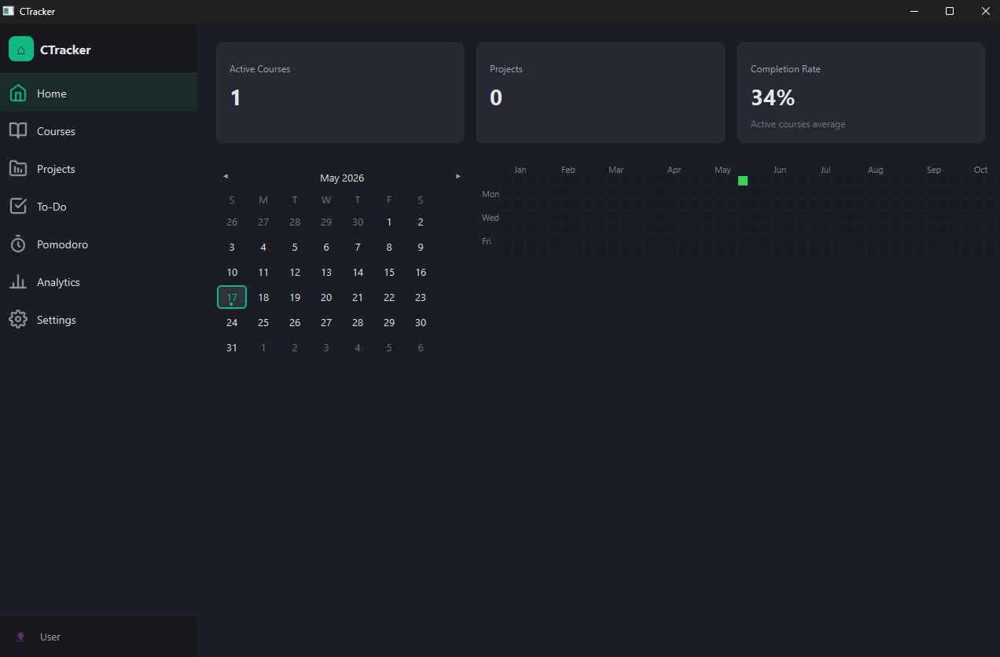
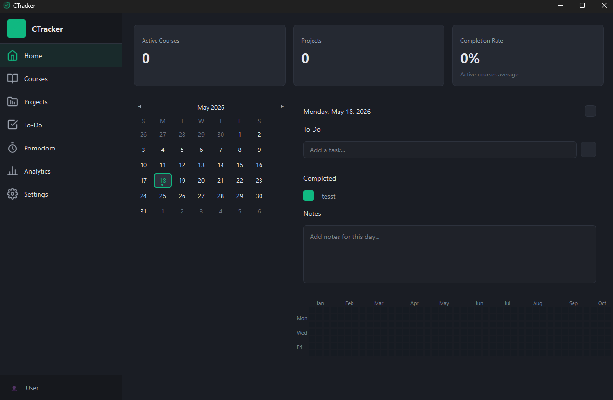
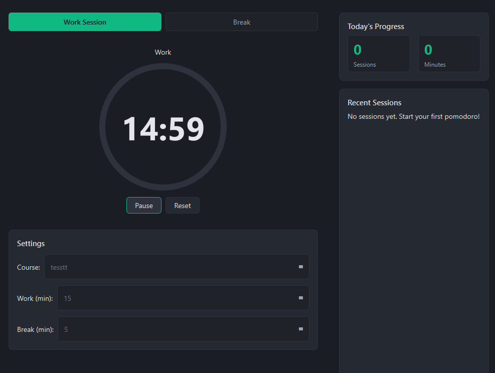
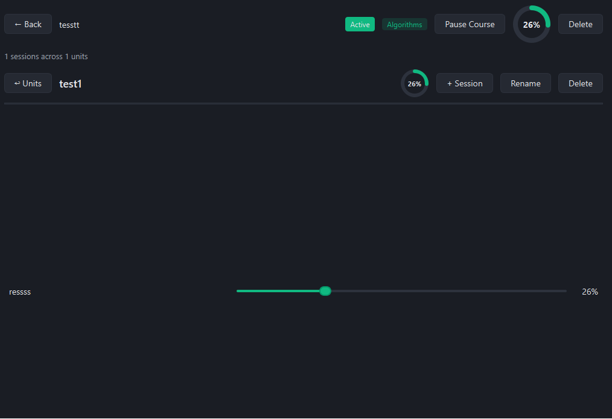
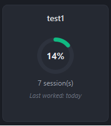
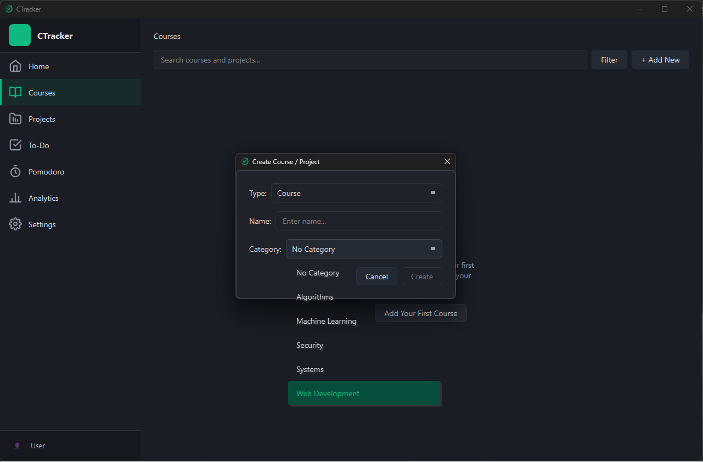
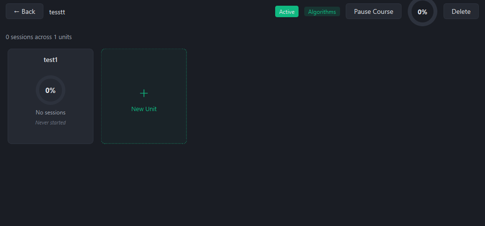

<div align="center">


# 🚀 CTracker

**A high-performance, native desktop application for productivity tracking, learning management, and focused execution.**

[](https://isocpp.org/)
[](https://www.qt.io/)
[](https://www.sqlite.org/)
[](https://cmake.org/)
[](https://www.figma.com/)
[](https://opensource.org/licenses/MIT)

*A bespoke Dark Industrial Desktop UI designed for zero distractions and maximum focus.*

---



</div>

## 📖 Overview

CTracker is a locally-hosted, standalone native application designed to unify your workflow. Whether you're tracking coursework, managing long-term projects, running Pomodoro focus sessions, or reviewing your detailed activity analytics — CTracker puts it all at your fingertips **without the overhead of electron-based apps or cloud subscriptions**.

## 💪 Why CTracker Stands Out

| Strength | Detail |
|---|---|
| **⚡ Native Performance** | Pure C++17 + Qt 6 — no Electron, no web runtime. Starts instantly, uses minimal RAM, and feels like a real OS application. |
| **🔒 100% Local & Private** | All data stays on your machine in a SQLite database. No accounts, no cloud sync, no telemetry. Your productivity data is yours alone. |
| **🎨 Dark Industrial UI** | A hand-crafted, distraction-free QSS theme (`#1a1d24` background) designed for extended focus sessions. Every pixel is intentional. |
| **📐 Figma-Driven Design** | UI layouts and interaction patterns were prototyped in Figma before implementation, ensuring consistent spacing, colors, and component behavior across every view. |
| **🏗️ Strict Model–View Architecture** | Clean separation between data models (`QAbstractTableModel`/`QAbstractListModel`) and custom widgets. Signal/Slot wiring — no spaghetti UI logic. |
| **📦 Import / Export** | Full JSON import/export pipeline. Bring your course data in from a structured JSON file, or export your progress to share or back up. |
| **🧪 Tested Foundation** | 15+ database tests, model validation tests, and widget behavior tests using the Qt Test framework — the core layer is verified before UI work begins. |
| **🔗 Pomodoro ↔ Tasks Integration** | The built-in Pomodoro timer links directly to your active tasks and automatically logs focused time into the activity system. |

## ✨ Core Features

*   **📚 Course & Project Mastery:** Create nested hierarchies. Break down high-level Projects and Courses into actionable Units, Sessions, and Tasks.
*   **⏱️ Built-in Pomodoro Engine:** A native desktop Pomodoro tracker that links directly to your active tasks and automatically logs your focused time.
*   **📅 Unified Calendar & Daily View:** Visualize tasks, deadlines, and completed Pomodoro sessions on an interactive calendar. Drill down into specific days to see detailed time-tracking logs.
*   **📊 Interactive Analytics:** Deep-dive into your productivity using QtCharts. View time spent across different categories, activity logs, and progress overviews.
*   **🎯 Todo Management:** A dedicated todo view with active/completed filtering, so nothing falls through the cracks.
*   **🎨 Dark Industrial UI:** A highly polished, bespoke UI utilizing native Qt Widgets customized with a distraction-free QSS theme.

## � Gallery

Experience the bespoke Dark Industrial UI designed for zero distractions.

| Main Dashboard & Overview | Analytics & Visualization |
| :---: | :---: |
|  |  |
| **Course & Unit Management** | **Activity Heatmap** |
|  |  |
| **Pomodoro Focus Sessions** | **To-Do Management** |
|  |  |
| **Session Tracking** | **Detailed Unit Cards** |
|  |  |

<details>
<summary><b>View more screenshots</b></summary>
<br>
<div align="center">
  
  <br>
  
  <br>
  
</div>
</details>

## �🛠️ Tech Stack & Architecture

CTracker prioritizes speed, native OS integration, and low memory footprint.

*   **Language:** C++17
*   **Framework:** Qt 6 (Core, Widgets, Sql, Charts, Svg)
*   **Database:** SQLite (Managed via a thread-safe, robust `DatabaseManager` singleton)
*   **Build System:** CMake
*   **Design Tool:** Figma (visual prototyping → translated to Qt widgets + QSS)
*   **Architecture:** Strict Model–View separation. The UI leverages XML UI files (`.ui`) combined with dynamic C++ custom widgets, and interfaces with the backend exclusively via standard Qt Item Models and strong Signal/Slot wiring.

> [!NOTE]
> **Design Prototype:** The `Design/` directory contains a React + Tailwind prototype that serves **exclusively as a visual reference** for spacing, colors, and layout structure — prototyped in Figma first, then validated in code. The production application translates these design concepts entirely into pure C++ and QSS.

## 📂 Project Structure

```text
├── CTracker/             # Main Source Code & Build Targets
│   ├── assets/           # QSS Stylesheets and SVG Icons
│   ├── include/          # C++ Headers (Grouped by module)
│   ├── src/              # C++ Implementations
│   └── tests/            # QtTest Framework Unit Tests
├── data/                 # Import example & user data (see example_import.json)
├── Design/               # Visual Reference (React Prototype + Figma-derived)
├── Photos/               # App screenshots & logo
└── README.md             # This file
```

## 📥 Data Import Format

CTracker supports importing courses and projects from a JSON file. The expected format is documented in [`data/example_import.json`](data/example_import.json):

```json
{
    "entities": [
        {
            "version": "1.0",
            "type": "course",
            "name": "Your Course Name",
            "units": [
                {
                    "name": "Unit Name",
                    "sessions": [
                        { "name": "Session Name", "progress": 0 }
                    ]
                }
            ]
        }
    ]
}
```

**Required fields per entity:** `version`, `type` (`"course"` or `"project"`), `name`, `units` (array).
**Required fields per session:** `name`, `progress` (integer, clamped to 0–100).

> [!TIP]
> You can import a single entity without the `entities` wrapper — just pass the entity object as the JSON root.

## � Getting Started

### Prerequisites
*   [CMake](https://cmake.org/download/) (3.20 or newer)
*   C++17 standard compatible compiler (MSVC / GCC / Clang)
*   [Qt 6 Toolkit](https://www.qt.io/) (requires `Core`, `Widgets`, `Sql`, `Charts`, and `Svg` modules)

### 1. Build the Project

Clone the repository and build via the provided PowerShell scripts or standard CMake commands:

```bash
git clone https://github.com/your-username/CTracker.git
cd CTracker

# Quick Build via script (Windows)
.\build_and_run.ps1
```

*Or manually:*
```bash
mkdir build && cd build
cmake ..
cmake --build .
```

### 2. Deploy and Run (Windows)

Before running the executable, ensure the required Qt DLLs are in your build path:

```powershell
# Deploys active Qt environment DLLs to the build folder
.\build_and_run.ps1

# Or launch directly
.\Run_CTracker.bat
```

## 🧪 Testing

The repository features comprehensive unit tests using the Qt Test suite.

```powershell
cd CTracker
.\run-tests.ps1
```

See [`CTracker/tests/README.md`](CTracker/tests/README.md) for the full test catalog and results.

## 🚦 Roadmap & Current Status

**Current Version:** `v0.0.8`
*   ✅ Core database layer (v1 + v2 schema with categories, todos, pomodoro, calendar, settings)
*   ✅ Architecture mapping (Model–View with strict separation)
*   ✅ Extensive testing suite (15+ database tests, model & widget tests)
*   ✅ JSON import/export pipeline
*   ✅ Pomodoro timer with task integration
*   ✅ Calendar view with daily drill-down
*   ✅ Analytics dashboard with contribution heatmap
*   ✅ Todo management with active/completed filtering
*   ✅ Figma-driven dark industrial UI theme
*   🚧 **Known Issue:** You may need to resize the application window slightly for the Course View to render/display correctly.

## 📜 License

This project is licensed under the MIT License — see the LICENSE file for details.

---
<div align="center">
  <i>Built with focus for focused work.</i>
</div>
